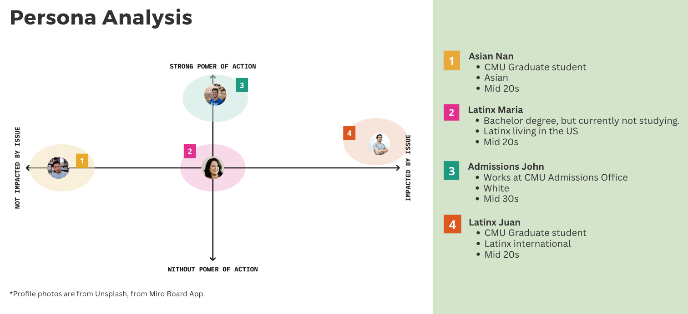

| [Home](README.md) | [Visualizing Government Debt](government-debt.md) | [Critique by Design](critique-by-design.md) | [Final Project I](final_part1.md) | [Final Project II](final-project-part-two.md) | [Final Project III](final-project-part-3.md)

# The final data story

Here there is a link to my project <a href='https://preview.shorthand.com/lpoNjDKQwfNvhE5L'>Diversity at Carnegie Mellon: Perspectives from a Latinx student</a>

# Changes made since Part II

On the last version of my Final Project I did several changes. I took the majority of the feedback I got, except for reducing my features. But, regarding this last feedback, I made the features more cohesive and smaller (Gini Index and Ranking), so that they weren't overwhelming or seemed disconnected. I also disregarded the Educational Attainment Chart, as I think it was too much information.

One of the most remarkable parts of my final project III was the interview I made with someone from the Admissions Office. That person gave me invaluable insights, revised my story and is going to introduce me to more people involved in the topic, so I might get a chance of moving my project further into action!

Regarding some design decisions I took:

* Changed the infographics to make them more clear.
* Set the call to action more clearly and made them stand out.
* Changed 'wicked problem' for 'complex problem', because my audience doesn't necessary need to know.
* Choosing the pallete in the beginning helped me a lot, and it's a good practice I'm applying to all my other programs.

Finally, I reorganized the story to have more cohesion and to have a smoother flow.

## The audience

First, I was targetting my project to every US potential and current student, as well as professors, admissions officers, etc. I realized I was aiming to achieve too much, so I restricted to four different personas: Latinx Maria, Latinx Juan, Asian Nan and Admission John. I analized them in a 2x2 matrix, regarding their power to change the problem and if they were being impacted by the problem.

‘It was interesting to learn about rankings as a potential reason for lack of diversity, but I am not sure what step to take next.’ I adressed this feedback, separating personas when adressing call to action. Information on Affirmative Action ban is for Asian Nan and Latinx Maria, CMU's resources are for Latinx Juan and developing better datasets is for Admissions John.

 

# Final thoughts

I am extremely satisfied with the results of my Final Project. It was hard work, but fulfilling. I am extremely excited to continue researching on this topic, as it fully impacts me.

I ran out of time to do more research on Affirmative action and potentially giving more tailored call to actions on that sense.
