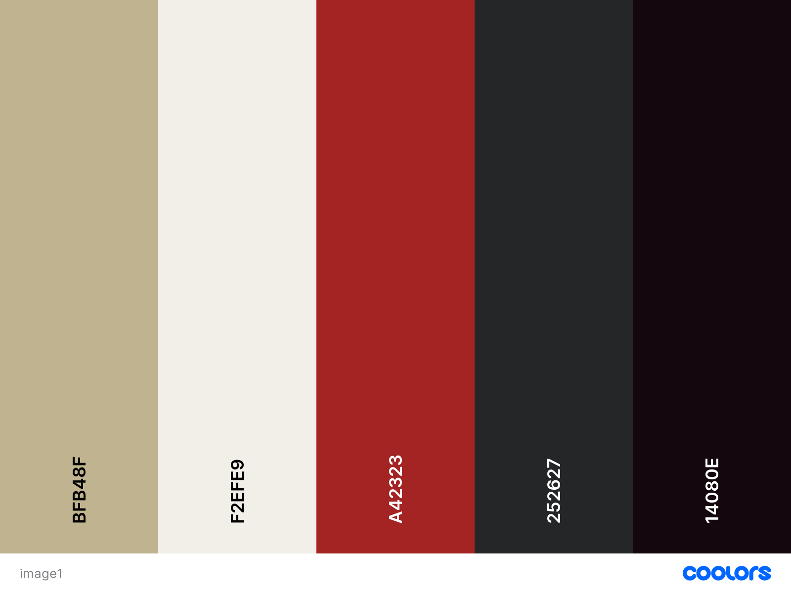

| [home page](https://cmustudent.github.io/tswd-portfolio-templates/) | [visualizing debt](visualizing-government-debt) | [critique by design](critique-by-design) | [final project I](final-project-part1) | [final project II](final-project-part-two) 

# Wireframes / storyboards

I found Shorthand extremely useful to tell my story. While presenting my initial Shorthand draft to my peers at class I got really good feedback about reorganizing my story. So I changed it 

# Charts

As we have talked about being cautious while using **pie charts**, I wanted to explain my choice of one for my first chart. As the difference between international and national graduate students is extremely notorious, the pie chart clearly transmit that ilusion. While I presented the pie chart to all my interviewees, they'll exclamated 'wow' each time, and that's the effect I want to create on them for anticipation, because then my topic is digging deeper on the opposite way, so the shock is going to be stronger.

For the population chart, I chose the **icon map**, because it was a creative way of generating engagement in the audience, and also it's easily associated with population.

Next, I decided to do a simple **bar chart** for the Universities, because here I am stating my problem and I want my point to be straightfowrard.

I started from a personal length, and now I wanted to expand a bit talking about other student's opinion on diversity at the University. I selected a varied sample of different ethnicities and asked them to posisionate themselves in the first day they were getting to CMU, and to think what were their feelings towards diversity. The responses were quite interesting, so I made an **infogram.** 

For my universities comparisson, I used multiple column charts/stacked charts.

Next, as I digged deeper in the problems, I knew the topic could get a little boring because of the amount of information. So i decided to do an animation with two maps, two showcase different metrics as the Gini index and educational attainment.

I made another **infogram** for the Universities ranking, as I think is an attractive way to compare information and make it stand out.

# User research 

## Target audience

My story is personal. But, as the saying goes, the personal becomes political. So my main goal is to gather the atention, first and foremost of the Latinx comunity at CMU, but also of every student at the University. Because it's an issue that should worry us all. 

Second, I would also want to transmit my message to the admissions department at CMU, as they are the main stakeholder in increasing Latinx presence at Campus.

## Interview script

My aim for the interviews were first understand if I was fulfilling my personal goals with this project:
* Understand if the topic was compelling to everyone. I am a Latinx and I felt strongly the lack of latinxs at Campus, so I might be biased toward the importance of the topic.
* Check if the 'Affirmative Action' is interesting for the audience and doesn't generate negative reactions.
* Make the audience want to participate in solving this issue.
* Generate highs and lows in the audience's emotions.

Second, get feedback about my structure, aesthetics and charts.

| Goal                            | Questions to Ask                                            |
|---------------------------------|----------------------------------------------------------   |                       
| Compelling topic and story?     | What excited you the most?                                  |
|                                 | What resonated with you the most?                           |
|                                 | What surprised you?                                         |
|                                 | What would you change?                                      |
| Affirmative action reaction?    | Check their reaction and ask them how they feel with it?    |
|                                 |                                                             |
| Make the audience want to    | What made you curious and which would be your next steps |
| participate in solving       | if any?                                                     |
| this issue                      |                                                             |
|                                 |                                                             |

## Interview findings

| Questions                        | Interview 1 - Latinx - CMU Graduate Student                         
|----------------------------------|----------------------------------------------------------------           
| What excited you the most?       | The information the story has,  the data showcased.
|                                  |
| What resonated with you the most?| The low percentage of Latinxs was shocking
|                                  |
| What would you change?           | Aesthetics in infographics, the infographic about university rankings is not clear  enough. 
|                                  | 
| Affirmative action reaction?     | It was really interesting to understand more on the topic. Now I want to do more research about it. 
|                                  | 
| What made you curious and which would be your next steps if any? | To research more about the disparty of US population and CMU population                   
|                                  |                                                        |   
|                                  |

| Questions                        | Interview 2                           
|----------------------------------|----------------------------------------------------------------           
| What excited you the most?       | 'The data is extremely interesting.'
|                                  |
| What resonated with you the most?| 'I think 'Asians' as an ethnicity is too  broad, because I feel I'm also underepresented and I'm from Southeast Asia. But I'm interested in the topic.'
|                                  |
| What would you change?           | 'The structure of the story is a bit confusing.  I would reorganize it. Also, I would stick only to the Gini index and not the educational attainment nor the rankings.'
|                                  | 
| Affirmative action reaction?     |  'It was wrong, I think it's interesting to  understand how we are going to make it better now'
|                                  | 
| What made you curious and which would be your next steps if any? |  'The CMU resources, I didn't know there were actions being taken.'                 
|                                  |                                                        |   
|                                  |

| Questions                        | Interview 3                         
|----------------------------------|----------------------------------------------------------------           
| What excited you the most?       | 'The graphs depicting diversity'
|                                  |
| What resonated with you the most?| 'Educational attainment by country'
|                                  |
| What would you change?           | -
|                                  | 
| Affirmative action reaction?     |  'Good to describe it as “wicked” problem, but does your audience know this design term? If so, then ok.'
|                                  | 
| What made you curious and which would be your next steps if any? | 'It was interesting to learn about rankings as a potential reason for lack of diversity, but I am not sure what step to take next.'               
|                                  |                                                        |   
|                                  |

# Identified changes for Part III 

* 
* 
* 

| Research synthesis                       | Anticipated changes for Part III                                                |
|------------------------------------------|---------------------------------------------------------------------------------|
| Lack of information of what steps to take after seeing this | Focusing more on the call to actions, give more options, do more interviews with key stakeholders of diversity (admissions, 'The center', etc.) |
|                                          |
| Structure is not compelling enough, and it's mixing | Continue reorganizing the structure of the story to make it more compelling. |
|                                          | 
| Infographics are not clear enough | Improve the infographics aesthetic, and make them stand out. Clarify the ranking infographic to make it more contrasting. |                                                                                                                   

* On a final note, I think I'm on the right track. I need to continue doing interviews, and focusing more on the outcomes. What is going to be the achievable next step for students to do something about this interesting issue?

# Color palettes

 

