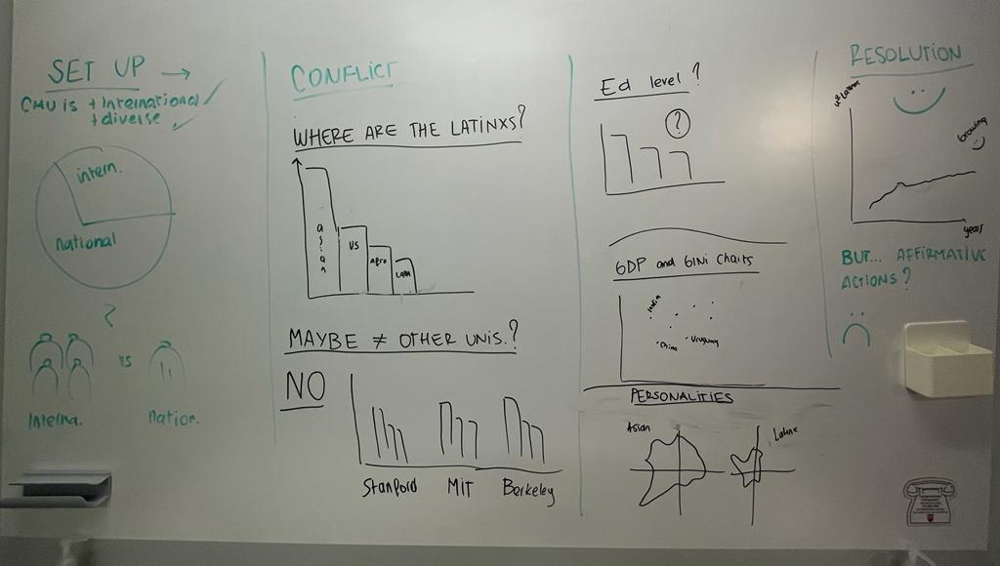

| [home page](README.md) | [visualizing debt](government-debt.md) | [critique by design](critique-by-design.md) | [final project I](final-part1) |

# Outline

Since I came, I have kept wondering why there are no Latinxs on Campus. This uncertainty scares me a bit. CMU is one of the top Tech Schools in the world, so is this reality the same across every top tech school in the USA? Technology is ruling the world, and the trend is going upward. Are we Latinxs falling behind the power that rules the world in any sense? If our future leaders are not going to the top schools, will our power and economic strength suffer in the long term? Is the Latin American political and economic crisis what we should blame? Or are we the Latinxs in ourselves that we are not giving our best to be here at the world's top tech schools?

All those questions come to mind while I go through the Campus corridors. Because, even if you don't believe these are the best schools in the world, we are missing a party everyone else seems to be invited to.

So, with this project, I aim to solve this mystery. I will analyze the database from the top tech universities in the US to understand if there is a pattern of a small Latinx community. Then, I will take the largest ethnic population and compare and contrast it with Latinxs across several metrics.

I will also review, compare and contrast:
* Latinx traits and personality. 
* Results of SAT testing.
* GDP and Gini indexes.
* Top universities.

I hope this research sheds some light on this controversial topic. While talking with my peers, I realized this is a reality that many of us question. It seems to be an alarming truth we should face as soon as possible.

> A project structure that outlines the major elements of your story.  Your Good Charts text talks about story structure in Chapter 8 - you should describe what you hope to achieve.  Make sure the outline is detailed enough that we can see how you anticipate your story unfolding.  You can incorporate your Story Arc from the in-class exercise along with your user stories and one sentence summary to make the topic even more clear.

(SETUP) 1) International students at CMU - general chart -  we all know CMU is highly international. - SETUP
(CONFLICT) 2) Title and open-ended question with closing (reveal technique)
(CONFLICT) 3) First chart - CMU
(CONFLICT) 5) Explaining why I decided to check another Tech university rates
(CONFLICT) 6) 3 major tech university charts compared
(CONFLICT) 7) Explaining potential reasons
  5a) Educational level - Sat scores charts
  5b) University rankings - Comparisson charts
  5b) Economical level - GDP and Gini charts
  5c) Personality traits - Comparing spider web charts
(RESOLUTION) 8) Conclussion (Why everyone should be worried, and call to action

## Initial sketches
> Post images of your anticipated data visualizations (sketches are fine). They should mimic aspects of your outline, and include elements of your story.  

Text here...

# The data
> A couple of paragraphs that document your data source(s), and an explanation of how you plan on using your data. 

Text here...

> A link to the publicly-accessible datasets you plan on using, or a link to a copy of the data you've uploaded to your Github repository, Box account or other publicly-accessible location. Using a datasource that is already publicly accessible is highly encouraged.  If you anticipate using a data source other than something that would be publicly available please talk to me first. 

| Name | URL | Description |
|------|-----|-------------|
|      |     |             |
|      |     |             |
|      |     |             |

# Method and medium
> I'm going to use Shorthand and create some mood boards in figma or Canvas and user personas on Hubspot (with 'Make my persona' tool).

# Initial Feedback

