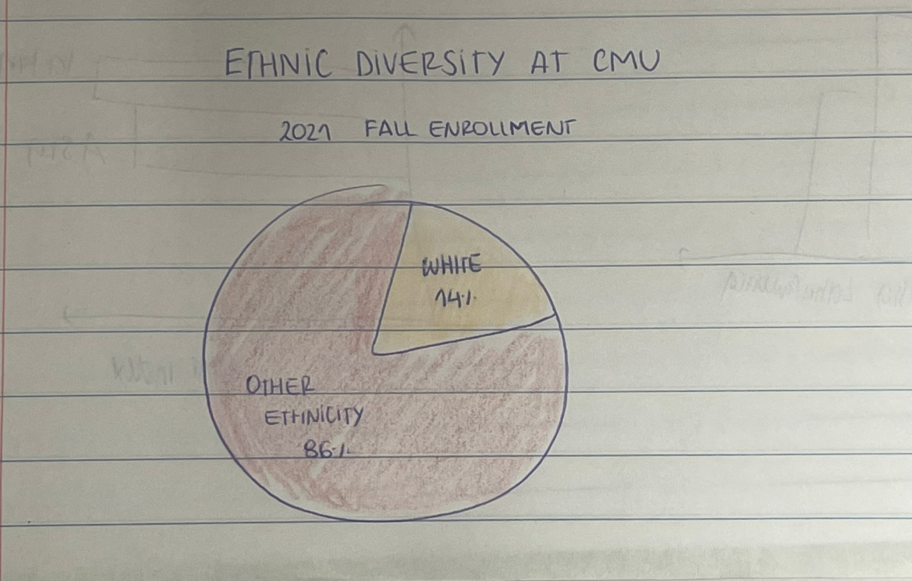

| [home page](README.md) | [visualizing debt](government-debt.md) | [critique by design](critique-by-design.md) | [final project I](final-part1) |

# Outline

I have been wondering why there are no Latinxs on Campus since I came. As technology continues evoluting and ruling the world, it would be wise for countries to train their people accordingly. CMU is one of the top Tech Schools in the world, and although its full of international students, the Latino population is extremely small. 

A lot of questions come to mind while I go through the Campus corridors. I wonder if this is the same across every top tech school in the USA? Are we Latinxs, in any sense, falling behind the power that is going to rule the world? If our future leaders are not coming to the top schools and the other countries leaders are, will our power and economic strength suffer in the long term? Is the Latin American political and economic crisis what we should blame? Or are we the Latinxs in ourselves that we are not giving our best to be here at the world's top tech schools?

>We are missing a party everyone else seems to be invited to.

With this project, I aim to solve this mystery. I will analyze the database from the top tech universities in the US to understand if there is a pattern of a small Latinx community. Then, I will take the largest ethnic population and compare and contrast it with Latinxs across several metrics such as:

* Educational level
* Gini indexes.
* Top universities.
* Personality traits. (Only information from articles).

I hope this research sheds some light on this controversial topic. While talking with my peers, I realized this is a reality that many of us question. It seems to be an alarming truth we should face as soon as possible.

# My project structure

**SETUP**

1) Diversity at CMU
* General chart of diversity at CMU (Pie chart) -> We all know CMU is highly international.
* Population in the US (metaphorical chart) -> Latinxs are the second biggest population of the US.
  
**CONFLICT** 

2) First chart - expected diversity vs. actual diversity at CMU 
1) Title and open-ended question with closing (reveal technique) 
3) Explaining why I decided to check another Tech university rates 
4) 3 major tech university charts compared 
5) Explaining other potential reasons 
* Educational level - 'Educational Attainment, at least Bachelor's or equivalent' Comparing selected countries.
* University rankings - Comparing top 5 Universities in Asia and Latin America
* Economical level - Gini index charts - possible relation? Comparing selected countries in Asia and Latin America.
* Personality traits - Brief citing from articles, currently I haven't found data to make charts.

**RESOLUTION**

 1) In the end, Latinx rates are growing. (Line chart). :) 
 2) But, Affirmative action possible consequences? (Text explanation) :(

# Initial sketches

* I'm going to do more user research to understand if the geographical is better than the bar chart.

# The data

1) I am planning to start describing how Latinxs are one of the biggest ethnic groups at the US right now and contrasting them with Asians.
2) Next, I am going to show how that trend is the opposite at Tech Universities current master's students.
3) After that, I am going to get more deep in the topic, trying to understand correlations between the foreign countries statistics of selected Asian and Latin countries, and the low quantity of Latinxs (American citizens who consider themselves Latinxs) pursuing a Master's degree at a top Tech university.
4) Finally, I am going to show how the trend is growing for Latinxs pursuing a degree, and explain how the Affirmative action can have consequences in this growing trend.

### Census
<a href="https://www.census.gov/quickfacts/fact/table/US/RHI725222" target="_blank">Census</a> - US population ethnicity

### University diversity status
<a href="https://www.cmu.edu/ira/Enrollment/pdf/fall-2022-pdfs/total-university-enrollment_ems-2.8.2023.pdf" target="_blank">CMU</a> 
<a href="https://drive.google.com/file/d/1x2DELfVgnZbgTsBbHmF0xZCGQusjDqv3/view" target="_blank">Stanford</a> 
<a href="https://facts.mit.edu/enrollment-statistics/" target="_blank">MIT</a> 
<a href="https://grad.berkeley.edu/admissions/choose-berkeley/rankings-stats/#panel-1-2" target="_blank">Berkeley</a>

### Educational levels
<a href="https://databank.worldbank.org/source/world-development-indicators" target="_blank">World Bank dataset</a> - Comparing 'Educational Attainment, at least Bachelor's or equivalent' in selected countries.

### Economical levels
<a href="https://databank.worldbank.org/source/world-development-indicators" target="_blank">Gini index</a> - Gini index charts - possible relation? Comparing selected countries in Asia and Latin America.

### University ranking
<a href="https://www.topuniversities.com/universities/asia?region=[4009]&sorting=[rankings_htol]" target="_blank">QS Worldwide ranking</a> - Comparing top 5 Universities in Asia and Latin America 

# Method and medium
I'm going to use Shorthand and create some mood boards in figma or Canvas and user personas on Hubspot (with 'Make my persona' tool).

# Initial Feedback

